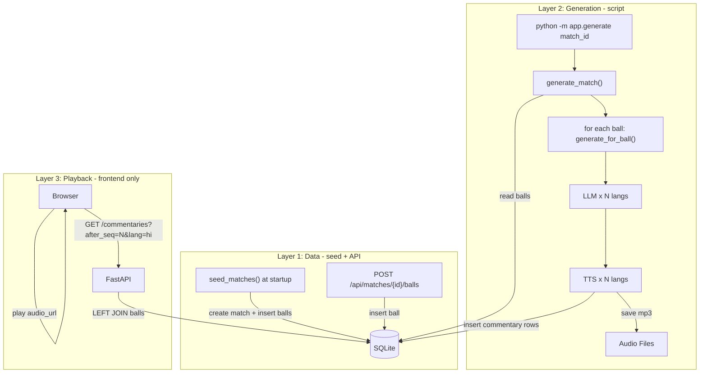

# Decouple Generation from Playback

## Problem

1. **Language change ignored mid-match** -- generation locked to initial language.
2. **Match proliferation** -- every "Start" creates a new DB row.
3. **Tight coupling** -- generation and playback in the same loop.
4. **Ball data on disk** -- should be in DB.

## Architecture

Three independent layers. No shared in-memory state between them.




## Data Model

### matches

```sql
CREATE TABLE matches (
    match_id    INTEGER PRIMARY KEY AUTOINCREMENT,
    title       TEXT NOT NULL,
    status      TEXT NOT NULL DEFAULT 'ready',
    match_info  TEXT NOT NULL DEFAULT '{}',
    languages   TEXT NOT NULL DEFAULT '["hi"]',
    created_at  TEXT NOT NULL
);
```

`status`: `ready` | `generating` | `generated`

### match_balls

```sql
CREATE TABLE match_balls (
    id          INTEGER PRIMARY KEY AUTOINCREMENT,
    match_id    INTEGER NOT NULL,
    innings     INTEGER NOT NULL,
    ball_index  INTEGER NOT NULL,
    over        INTEGER NOT NULL,
    ball        INTEGER NOT NULL,
    batsman     TEXT NOT NULL,
    bowler      TEXT NOT NULL,
    data        TEXT NOT NULL,
    FOREIGN KEY (match_id) REFERENCES matches(match_id)
);
CREATE INDEX idx_match_balls ON match_balls(match_id, innings, ball_index);
```

### match_commentaries

One row per language per moment. `language = NULL` for language-independent events.

```sql
CREATE TABLE match_commentaries (
    id          INTEGER PRIMARY KEY AUTOINCREMENT,
    match_id    INTEGER NOT NULL,
    ball_id     INTEGER,
    seq         INTEGER NOT NULL,
    event_type  TEXT NOT NULL,
    language    TEXT,
    text        TEXT,
    audio_url   TEXT,
    data        TEXT NOT NULL DEFAULT '{}',
    created_at  TEXT NOT NULL,
    FOREIGN KEY (match_id) REFERENCES matches(match_id),
    FOREIGN KEY (ball_id) REFERENCES match_balls(id)
);
CREATE INDEX idx_match_commentaries ON match_commentaries(match_id, seq);
CREATE INDEX idx_match_commentaries_lang ON match_commentaries(match_id, language, seq);
```

**Row pattern:**


| seq | event_type   | language | text                    | ball_id |
| --- | ------------ | -------- | ----------------------- | ------- |
| 1   | match_start  | NULL     | NULL                    | NULL    |
| 2   | score_update | NULL     | NULL                    | 42      |
| 3   | commentary   | hi       | शानदार छक्का!           | 42      |
| 3   | commentary   | en       | What a six!             | 42      |
| 4   | commentary   | hi       | (end_of_over narrative) | 42      |
| 4   | commentary   | en       | (end_of_over narrative) | 42      |


Same `seq` across languages for the same moment.

### Polling query

```sql
SELECT c.*, b.over, b.ball, b.batsman, b.bowler, b.data as ball_data
FROM match_commentaries c
LEFT JOIN match_balls b ON c.ball_id = b.id
WHERE c.match_id = ? AND c.seq > ? AND (c.language = ? OR c.language IS NULL)
ORDER BY c.seq
```

## Layer 1: Data -- [app/storage/database.py](app/storage/database.py)

### Seed (`seed_matches()` called at startup)

1. Scan `app/feed/*.json`
2. Skip if match already exists (check by title)
3. Create match with `match_info` (teams, venue, target, first_innings summary)
4. Insert all balls from both innings into `match_balls`
5. Status = `ready`

### DB functions needed

- `create_match(title, match_info, languages)` -> match dict
- `get_match(match_id)` -> match dict
- `list_matches(status?)` -> list
- `update_match_status(match_id, status)`
- `insert_ball(match_id, innings, ball_index, over, ball, batsman, bowler, data)` -> ball_id
- `get_balls(match_id, innings)` -> list of ball dicts
- `insert_commentary(match_id, ball_id, seq, event_type, language, text, audio_url, data)` -> id
- `get_commentaries_after(match_id, after_seq, language)` -> list (LEFT JOIN query)
- `delete_commentaries(match_id)` -- clear before re-generation
- `get_max_seq(match_id)` -> int -- for resuming seq counter

## Layer 2: Generation -- [app/generate.py](app/generate.py) (NEW)

A standalone module, runnable as a script:

```bash
python -m app.generate 1          # generate for match_id=1
python -m app.generate 1 --start_over=7  # start from over 7
```

### `generate_for_ball(match_id, ball_id, ball, state, logic_result, languages, seq_counter)`

The atomic unit. Produces commentaries for one ball:

1. Insert `score_update` (language=NULL, seq=N)
2. For each language in parallel (`asyncio.gather`):
  - `generate_commentary(state, ball, logic_result, language=lang)`
  - `synthesize_speech(text, branch, is_pivot, language=lang)`
  - `save_audio(match_id, text, lang, audio_bytes)` -- cache-aware
  - `insert_commentary(match_id, ball_id, seq=N+1, "commentary", language=lang, text, audio_url, data)`
3. Check post-ball narratives (milestone, new_batsman, end_of_over, phase_change):
  - Each narrative: seq++, one row per language

### `generate_match(match_id, start_over=1)`

The runner. Processes all balls for a match:

```python
async def generate_match(match_id: int, start_over: int = 1):
    match = await get_match(match_id)
    languages = json.loads(match["languages"])
    balls = await get_balls(match_id, innings=2)

    await update_match_status(match_id, "generating")
    await delete_commentaries(match_id)  # fresh start

    state_mgr = StateManager(...)
    logic_engine = LogicEngine()
    seq = 0

    # Fast-forward before start_over
    for b in balls_before_start_over:
        state_mgr.update(BallEvent(**json.loads(b["data"])))

    # match_start event
    seq += 1
    await insert_commentary(match_id, None, seq, "match_start", None, None, None, match_info)

    # Pre-match narratives (if start_over=1)
    ...

    # Ball-by-ball
    for ball_row in live_balls:
        ball = BallEvent(**json.loads(ball_row["data"]))
        state = state_mgr.update(ball)
        logic_result = logic_engine.analyze(state, ball)

        seq = await generate_for_ball(
            match_id, ball_row["id"], ball, state, logic_result, languages, seq
        )
        # No delay needed -- generation isn't paced for playback

    # match_end + match_result narrative
    ...

    await update_match_status(match_id, "generated")
```

### `__main__` block

```python
if __name__ == "__main__":
    import sys
    match_id = int(sys.argv[1])
    start_over = int(sys.argv[2]) if len(sys.argv) > 2 else 1
    asyncio.run(generate_match(match_id, start_over))
```

## Layer 3: Playback -- Frontend Only

### Backend API ([app/main.py](app/main.py))

Slim read-only API (plus ball addition for future live feed):

- `GET /` -- index.html
- `GET /match/{match_id}` -- index.html (SPA)
- `GET /api/languages`
- `GET /api/matches` -- list matches
- `GET /api/matches/{match_id}` -- match detail
- `POST /api/matches/{match_id}/balls` -- add one ball (for future live feed)
- `GET /api/matches/{match_id}/commentaries?after_seq=0&language=hi` -- polling

**Remove everything else**: SSE, LiveMatch, broadcast, /api/start, /api/stop, /api/status, /api/match-info

### Frontend ([static/app.js](static/app.js))

**Behavior by match status:**

- `**generating**` (live match):
  - Poll `GET /commentaries?after_seq=N&language=hi` every 3 seconds
  - New commentaries arrive -> update scoreboard, add to feed, queue audio
  - Audio plays automatically as commentaries come in
  - Stop polling when status changes to `generated`
- `**generated**` (completed match):
  - Fetch all commentaries at once: `GET /commentaries?after_seq=0&language=hi`
  - Show all commentary in feed, update scoreboard to final state
  - Show **Play** button
  - Play button starts sequential audio playback from over 1 (walks through audio_urls in seq order)
- `**ready**` (no commentaries yet):
  - Show message: "Commentary not generated yet"

**Language switcher:**

- Dropdown in the player view
- Switching: `lastSeq = 0`, clear UI, re-fetch with new language
- Score updates (language=NULL) come through in every query

```javascript
let lastSeq = 0;
let pollTimer = null;
let selectedLang = 'hi';

async function openMatch(matchId) {
    const data = await fetch(
        `/api/matches/${matchId}/commentaries?after_seq=0&language=${selectedLang}`
    ).then(r => r.json());

    processCommentaries(data.commentaries);

    if (data.match.status === 'generating') {
        startPolling(matchId);
    } else if (data.match.status === 'generated') {
        showPlayButton();  // user clicks to start audio playback
    }
}

function switchLanguage(lang) {
    selectedLang = lang;
    lastSeq = 0;
    clearCommentary();
    openMatch(currentMatchId);
}
```

### [static/index.html](static/index.html)

- Language selector in **player view** (not just home)
- Match list: "Watch" for generating, "View" for generated, nothing for ready
- Player view: Play button for completed matches

## File-Level Summary


| File                                               | What                                                                    |
| -------------------------------------------------- | ----------------------------------------------------------------------- |
| [app/storage/database.py](app/storage/database.py) | 3-table schema, seed with balls, all CRUD, polling query                |
| [app/storage/audio.py](app/storage/audio.py)       | Content-hash filenames, disk-cache                                      |
| **[app/generate.py](app/generate.py)** (NEW)       | `generate_for_ball()` + `generate_match()` + CLI runner                 |
| [app/main.py](app/main.py)                         | Slim API: match CRUD, POST /balls, GET /commentaries. No SSE/broadcast. |
| [static/app.js](static/app.js)                     | Polling player, language switcher, play button for completed            |
| [static/index.html](static/index.html)             | Language selector in player, updated match list actions                 |
| [app/feed/mock_feed.py](app/feed/mock_feed.py)     | Kept for seed only                                                      |


