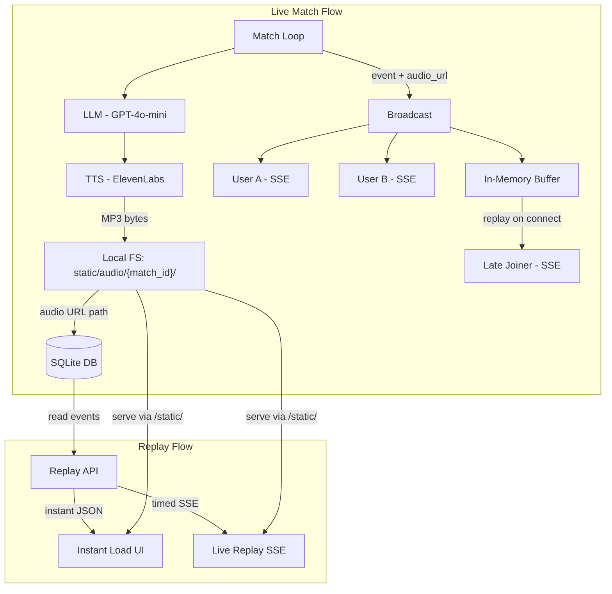

# Multi-Match Architecture with Local Audio Storage

## Current State

- Single global match (`match_running`, `event_history`, `subscribers`)
- Audio as base64 strings embedded in SSE JSON (~50-200KB per ball event)
- No persistence — everything lost on restart
- No match ID concept — single JSON file loaded

## Target Architecture




## Key Change: audio_base64 replaced by audio_url

Instead of embedding base64 audio in every SSE event, we:

1. Save MP3 to `static/audio/{match_id}/{seq}.mp3` on generation
2. Store the URL path (e.g. `/static/audio/m_abc123/42.mp3`) in SQLite and broadcast it
3. Frontend uses `new Audio(url)` instead of `new Audio('data:audio/mpeg;base64,...')`

Benefits: smaller SSE payloads (~100 bytes URL vs ~100KB base64), browser caching, files survive server restarts, easy migration to GCS/S3 later by swapping the storage module.

---

## 1. SQLite Persistence Layer

**New file: [app/storage/database.py**](app/storage/database.py)

Two tables using `aiosqlite`:

- **matches** — `match_id` (TEXT PK), `title`, `status` (live/completed), `match_info` (JSON), `language`, `start_over`, `created_at`
- **match_events** — `id` (INTEGER PK), `match_id` (FK), `seq` (INT, ordering), `event_type` (TEXT), `data` (JSON), `audio_url` (TEXT nullable), `created_at`

Functions:

- `init_db()` — create tables if not exist (called in lifespan)
- `create_match(match_id, title, match_info, language, start_over) -> Match`
- `update_match_status(match_id, status)`
- `insert_event(match_id, seq, event_type, data, audio_url) -> int`
- `get_match(match_id) -> dict`
- `list_matches(status=None) -> list[dict]`
- `get_match_events(match_id) -> list[dict]`

---

## 2. Local Audio Storage

**New file: [app/storage/audio.py**](app/storage/audio.py)

Directory structure: `static/audio/{match_id}/{seq}.mp3`

Functions:

- `save_audio(match_id: str, seq: int, audio_bytes: bytes) -> str` — writes MP3 file, returns URL path `/static/audio/{match_id}/{seq}.mp3`

Already served by FastAPI's existing static mount: `app.mount("/static", StaticFiles(directory="static"))`.

This module is a thin wrapper. Later, swap it out for a GCS/S3 module that returns a cloud URL instead — zero changes needed in the rest of the codebase.

---

## 3. Per-Match State in main.py

**Modify: [app/main.py**](app/main.py)

Replace globals with a per-match registry:

```python
@dataclass
class LiveMatch:
    match_id: str
    running: bool = False
    subscribers: list[asyncio.Queue] = field(default_factory=list)
    event_history: list[dict] = field(default_factory=list)
    event_seq: int = 0  # incrementing counter for audio filenames
```

```python
live_matches: dict[str, LiveMatch] = {}
```

Updated API routes (all scoped by match_id):

- `POST /api/matches/{match_id}/start?start_over=N&language=en` — start live match
- `POST /api/matches/{match_id}/stop` — stop live match
- `GET /api/matches/{match_id}/live` — SSE stream for live match (with late-join replay)
- `GET /api/matches/{match_id}/events` — all stored events as JSON (instant replay)
- `GET /api/matches/{match_id}/replay` — SSE re-stream from DB at natural pace
- `GET /api/matches` — list all matches with status
- `GET /api/matches/{match_id}` — match detail + metadata

The `broadcast()` and `_run_match()` functions take `match_id` and use `live_matches[match_id]` instead of globals.

---

## 4. TTS Changes

**Modify: [app/audio/tts.py](app/audio/tts.py) and [app/audio/elevenlabs.py**](app/audio/elevenlabs.py)

- `synthesize_speech()` returns raw MP3 **bytes** instead of base64 string
- Caller (match loop) saves to local storage and gets the URL path
- This keeps TTS provider-agnostic and storage-agnostic

In the match loop (`_run_match`):

```python
audio_bytes = await synthesize_speech(text, branch, is_pivot, language)
if audio_bytes:
    audio_url = save_audio(match_id, seq, audio_bytes)
else:
    audio_url = None
# Broadcast with audio_url, persist to SQLite
```

---

## 5. Frontend Changes

**Modify: [static/app.js**](static/app.js)

- Replace `audio_base64` handling with `audio_url`
- `queueAudio(url)` uses `new Audio(url)` directly (simpler than base64)
- Add match selection/routing (match list page vs match detail page)

**Modify: [static/index.html**](static/index.html)

- Add a match list view (shows live matches with "Watch" button, completed with "Replay" button)
- Match detail view stays mostly the same
- Replay mode: add "Watch Live Replay" button + ability to click play on individual commentary items

---

## 6. Replay Modes

**Instant load** (`GET /api/matches/{match_id}/events`):

- Returns all events as a JSON array from SQLite
- Frontend renders all commentary at once, scoreboard shows final state
- Each commentary item has a small play button for its `audio_url`

**Real-time re-stream** (`GET /api/matches/{match_id}/replay`):

- SSE endpoint that reads events from SQLite
- Sends them with `ball_delay_seconds` timing between balls
- Frontend treats it identically to a live stream (audio auto-plays)

---

## Dependencies

New package to add to `requirements.txt`:

- `aiosqlite` — async SQLite

(GCS can be added later by creating `app/storage/gcs.py` with the same `save_audio()` interface)